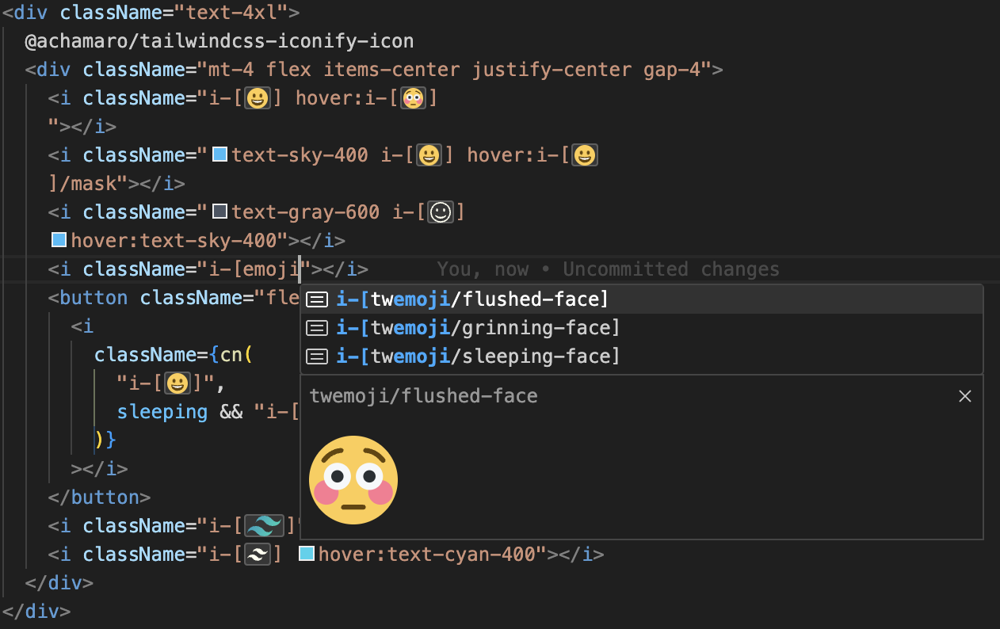

# TailwindCSS Iconify Icon IntelliSense

This extension supports [@achamaro/tailwindcss-iconify-icon](https://www.npmjs.com/package/@achamaro/tailwindcss-iconify-icon).

## Features

- Completion for icon class name
- Display icon inline

## Extension Settings

### tailwindcssIconifyIconIntelliSense.downloadDir

- **Type**: `string`
- **Default**: `src/assets/icons`

### tailwindcssIconifyIconIntelliSense.customSvg

- **Type**: `Record<string, string>`
- **Default**: `{}`
